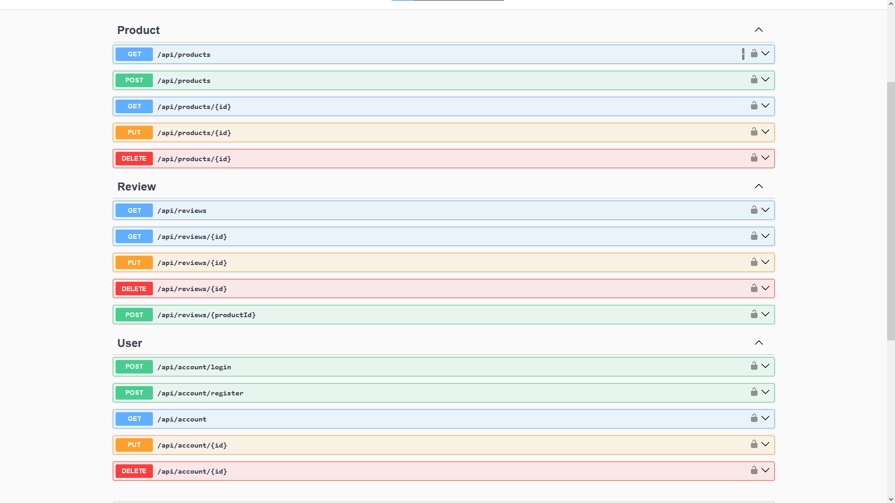

# Product Review API

This is a C# API project developed as a college project using .NET 8. The API allows users to manage accounts, log in, view products and their reviews, as well as create, edit, and delete them. The purpose of this project is to demonstrate basic API functionality with authentication, CRUD operations, and database interaction (filtering, pagination, sorting, and management of foreign key relationships).

### Prerequisites

- .NET 8 SDK
- Visual Studio
- SQL Server/SSMS

### Instructions

- Open ```ProductReviewAPI.sln```
- Build > Clean solution
- Tools > NuGet Package Manager > Package Manager Console
- In ```appsettings.json``` replace ```PC_NAME``` and ```DB_NAME``` (Windows Authentication)
- Run the commands ```Add-Migration init``` and ```Update-Database```

##

